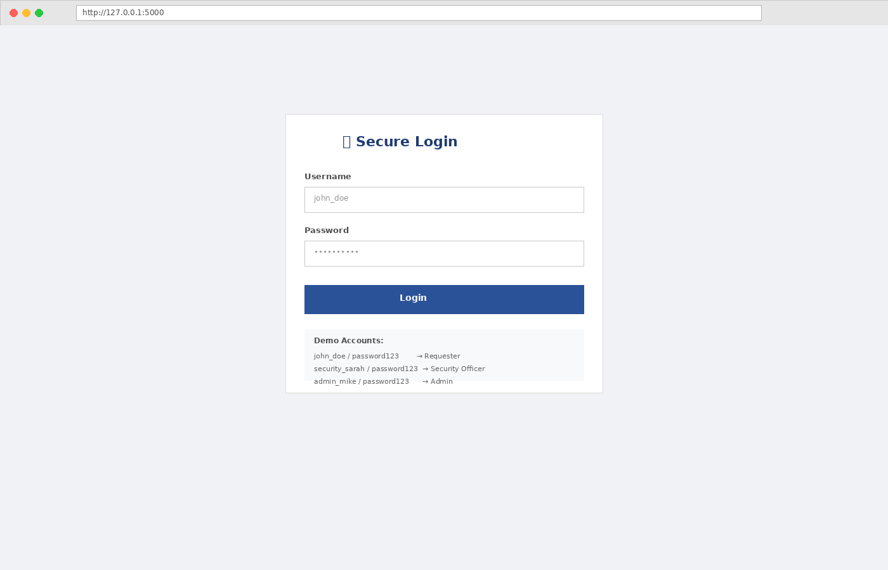
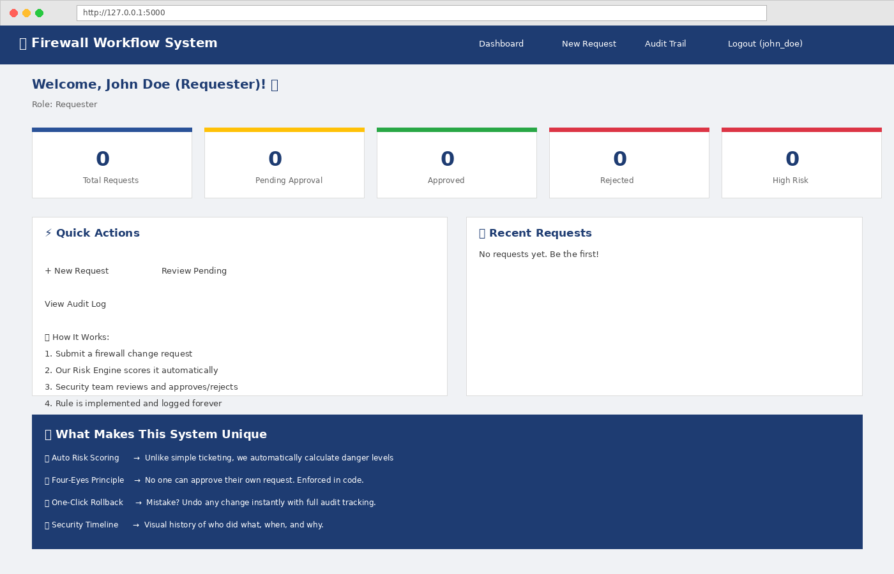
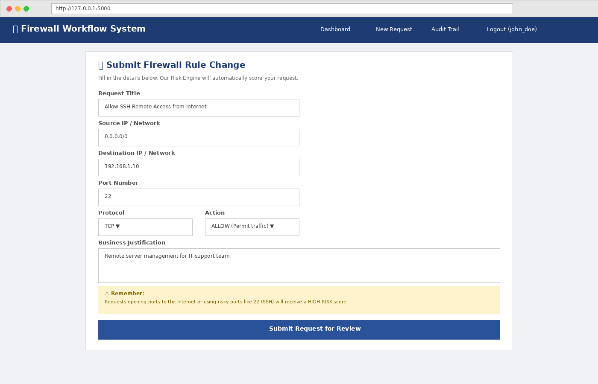
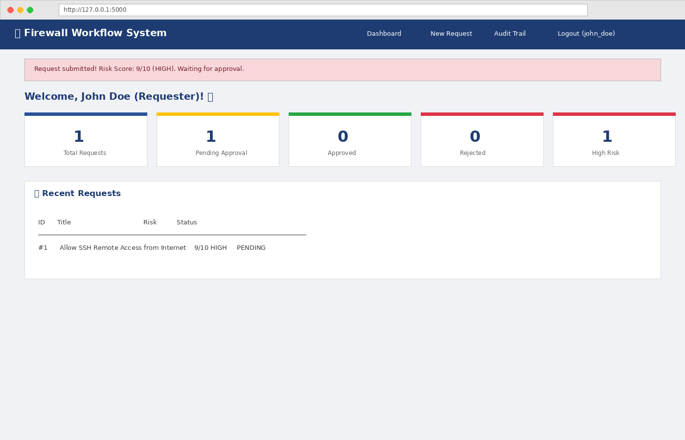
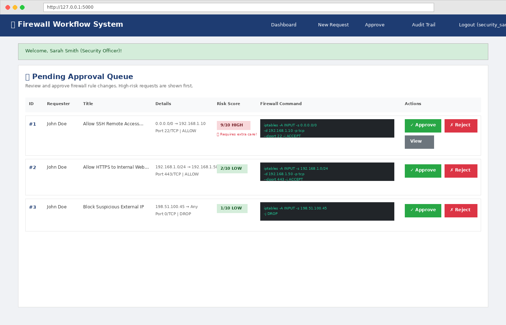
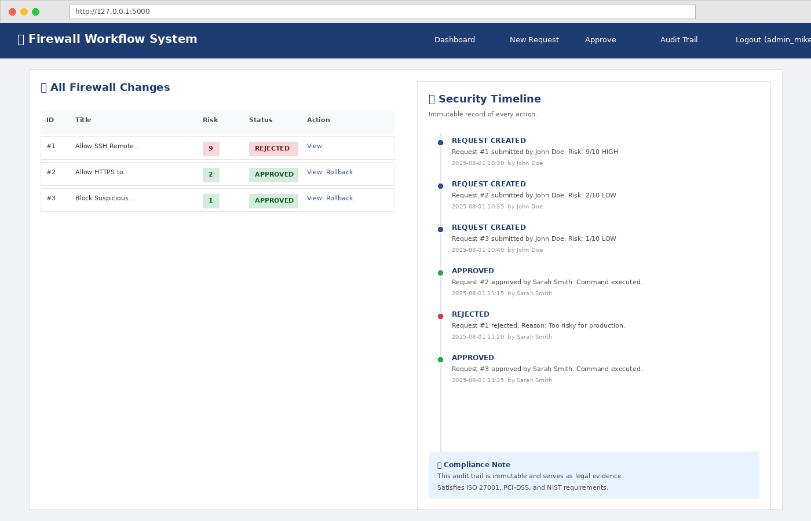
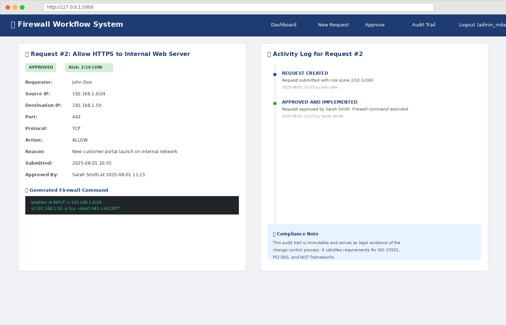
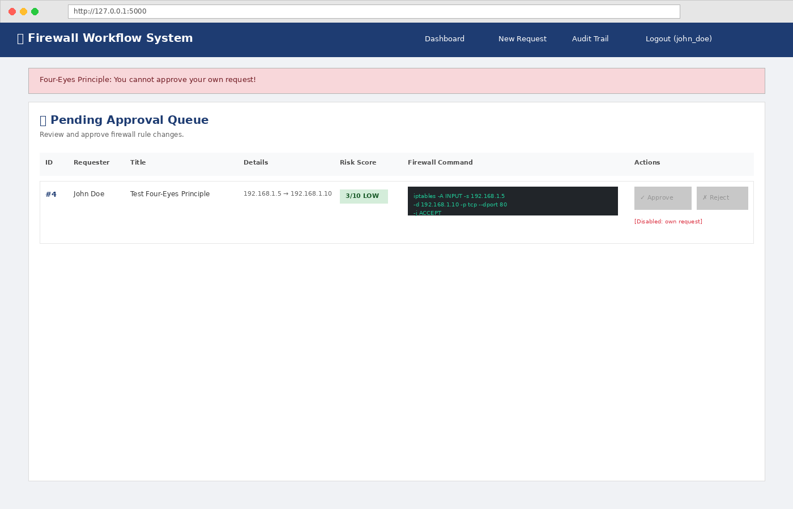
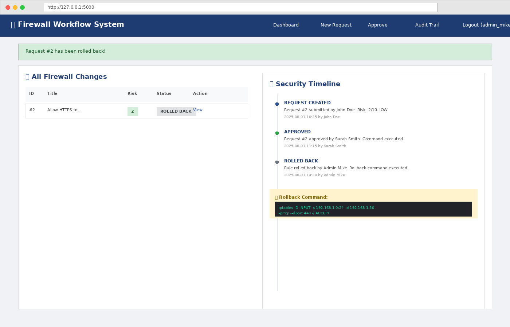

# Automated Firewall Rule Change Management

> **Version:** 1.0 | **Last Updated:** August 2025 & Approval Workflow

> **Course:** CY376 — Network Monitoring, Security and Auditing  
> **Team:** Blue Team (Defensive Security)  
> **Date:** August 2025  
> **Status:** Complete and Functional

---

## Project Summary

This project is a fully functional web-based system that automates how firewall rules are requested, reviewed, approved, and tracked. Instead of managing firewall changes through email and spreadsheets — which leads to typos, missing approvals, and no accountability — this system provides a structured workflow with intelligent risk scoring, role-based approvals, and an immutable audit trail.

The prototype demonstrates the same core principles used by enterprise tools like **AlgoSec**, **Tufin**, and **FireMon**, but built entirely with free, open-source software that runs on any laptop.

---

## What Problem This Solves

In many organizations, firewall changes still work like this:

1. Someone sends an email: *"Hey, open port 22 for me"*
2. A network admin reads it, logs into the firewall, and types commands by hand
3. The admin makes a typo — opening the port to the **entire Internet** instead of one IP
4. A hacker finds it within hours
5. When investigators ask *"Who approved this?"* — nobody knows

This system fixes that by:
- **Standardizing** requests through a web form
- **Scoring** risk automatically before anyone approves
- **Enforcing** the Four-Eyes Principle (you can't approve your own request)
- **Generating** exact firewall commands with zero typos
- **Logging** every action permanently for compliance

---

## Tools Used

| Tool | Purpose |
|------|---------|
| Python 3.13 | Core application logic |
| Flask 3.0 | Web framework for HTTP routing and templates |
| SQLite 3 | Database for users, requests, and audit logs |
| Werkzeug | Password hashing and secure session management |
| HTML/CSS | Frontend user interface |
| Jinja2 | Template rendering engine (built into Flask) |

---

## Repository Structure

```
firewall-workflow/
├── src/                    # Source code
│   ├── app.py             # Main Flask application
│   ├── requirements.txt   # Python dependencies
│   └── templates/         # HTML page templates
├── configs/               # Configuration files (future use)
├── scripts/               # Utility scripts (future use)
├── docs/                  # Documentation
│   ├── README.md          # Original project readme
│   ├── Firewall_Change_Management_Report.docx
│   └── Firewall_Workflow_Presentation.pptx
├── evidence/              # Screenshots and test evidence
│   └── screenshots/       # UI screenshots for report and demo
├── .gitignore             # Git ignore rules
└── README.md              # This file
```

---

## How to Run

### Prerequisites
- Python 3.8 or higher
- A web browser
- Internet connection (first time only, to install Flask)

### Installation

```bash
# 1. Navigate to the source folder
cd src

# 2. Install dependencies
pip install -r requirements.txt

# 3. Run the application
python app.py

# 4. Open your browser and go to:
# http://127.0.0.1:5000
```

### Default Login Credentials

| Role | Username | Password |
|------|----------|----------|
| Requester | `john_doe` | `password123` |
| Security Officer | `security_sarah` | `password123` |
| Admin | `admin_mike` | `password123` |

---

##  Key Features

###  Auto Risk Scoring Engine
Every request is automatically scored from 0 to 10 based on:
- **Port danger** (SSH=+4, RDP=+4, common services=+2)
- **Network exposure** (Internet=+3, internal=+0)
- **Protocol** (UDP=+1)
- **Action type** (ALLOW=+1, DROP=-2)

### Four-Eyes Principle
The person who submits a request **cannot** approve it. This separation of duties is enforced in code, not just written in a policy document.

### Immutable Audit Trail
Every action is recorded with timestamp, user name, and details. The log cannot be altered through the application interface. This satisfies compliance requirements for **ISO 27001**, **PCI-DSS**, and **NIST**.

### One-Click Rollback
Admins can instantly undo any approved change. The system automatically generates the reverse command (replacing `-A` with `-D` in iptables syntax).

### Automatic Command Generation
The system generates exact `iptables` commands based on the request. No manual typing means no typos.

---
## Screenshots

| Feature | Screenshot |
|---------|-----------|
| Login Page |  |
| Requester Dashboard |  |
| New Request Form |  |
| High Risk Alert |  |
| Approval Queue |  |
| Audit Timeline |  |
| Request Detail |  |
| Four-Eyes Enforcement |  |
| Rollback |  |

---

## For Instructors

This repository contains:
- **Complete source code** in `src/`
- **Full written report** in `docs/Firewall_Change_Management_Report.docx`
- **Presentation slides** in `docs/Firewall_Workflow_Presentation.pptx`
- **Test evidence** (screenshots) in `evidence/screenshots/`

The commit history reflects incremental development across the project period, with commits at the completion of each major feature.

---

## Future Improvements

- Integrate with live firewalls via SSH (Paramiko) or vendor APIs
- Migrate from SQLite to PostgreSQL for production concurrency
- Add email/Slack notifications for pending approvals
- Implement rule conflict detection
- Add automatic rule expiration with recertification workflows
- Deploy Multi-Factor Authentication (MFA)
- Containerize with Docker and Kubernetes

---

## License

Built for educational purposes as part of CY376 coursework.


